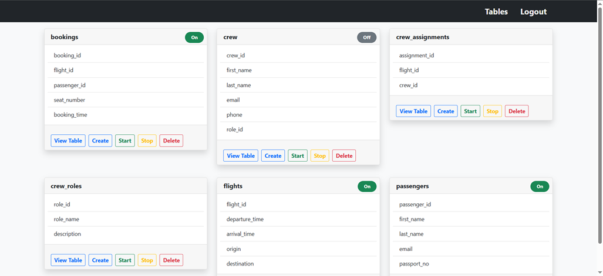
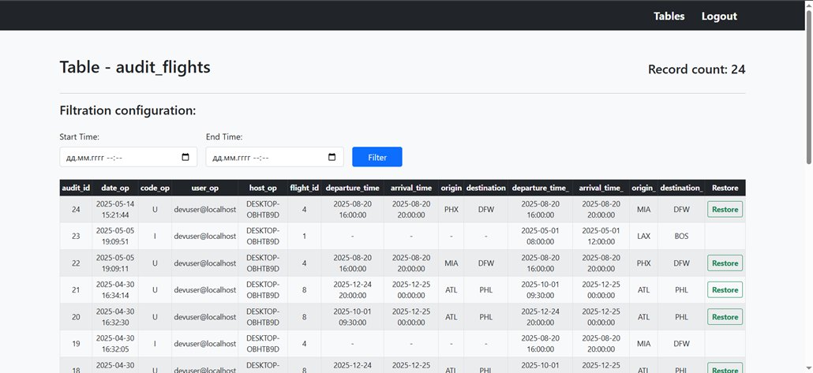

# Tools for Logging and Recovery of Critical Data in Airline IT Systems

## 📖 About the Project

This project is a web application designed for **logging and recovering critical data** within an airline's IT system. The system provides administrators with tools to dynamically monitor changes in database tables, view modification history, and quickly restore data after accidental or malicious actions.

### 🎯 The Problem

The reliability and security of airline IT systems directly impact operational stability and passenger safety. Accidental or intentional alteration of critical data—such as passenger information, flight details, or crew assignments—can lead to financial losses and operational disruptions.

While many existing data audit solutions are complex and resource-intensive, this project offers a **flexible and universal tool** that does not require integration at the business logic level, significantly simplifying its implementation and use.

### ✨ Key Features

* **Administrator Authentication:** Secure login for authorized users.
* **Database Schema Viewer:** View all tables and their structures within the database.
* **Dynamic Audit Management:**
    * **Create Audit Table:** Dynamically generate audit tables for monitoring without code changes.
    * **Start Logging:** Create `INSERT`, `UPDATE`, `DELETE` triggers for a selected table.
    * **Stop Logging:** Remove triggers to cease logging.
* **Change History Viewer:** Review the history of data changes in a user-friendly web interface.
* **Data Recovery:** Restore records to their previous state from `UPDATE` and `DELETE` operation logs.

### 📸 Screenshots

*Administrator Dashboard for managing table logging:*



*Audit log view with data recovery options:*



---

## 🛠️ Tech Stack

| Component | Technology |
| :--- | :--- |
| **Backend** | **Java 17**, **Spring Boot**, **Spring Security**, **Spring JDBC** |
| **Frontend** | **Thymeleaf**, **Bootstrap 5** |
| **Database** | **MySQL 8** |
| **Build Tool** | **Maven** |
| **Testing** | **AssertJ**, **Mockito** |

---

## 🚀 Getting Started

### Prerequisites

Before you begin, ensure you have the following installed:

* **JDK 17** or later.
* **MySQL 8**.
* **Apache Maven**.

### Installation & Setup

1.  **Clone the repository:**
    ```bash
    git clone https://github.com/rudyevhenii/airline-data-logger.git
    cd airline-data-logger
    ```

2.  **Set Environment Variables:** Before running the application, you must set the following two environment variables in your terminal or your IDE's run configuration:
    * `DB_USERNAME`: Your MySQL username (e.g., `root`).
    * `DB_PASSWORD`: Your MySQL password.

        Here is an example of how to set them in a Linux/macOS terminal:
        ```bash
        export DB_USERNAME=root
        export DB_PASSWORD=your_secret_password
        ```
    * The application will automatically create the required tables and populate initial data on startup, as configured by `spring.sql.init.mode=always`.

3.  **Run the application:**
    * You can run the project from your IDE (e.g., IntelliJ IDEA) by running the `AirlineDataLoggerApplication` main class.
    * Alternatively, use the Maven command in your terminal:
        ```bash
        mvn spring-boot:run
        ```

4.  **Access the application:**
    Open your web browser and navigate to `http://localhost:8080`.

---

## 🔑 Usage

To log in to the system, use the default administrator account:

* **Login:** `admin1@gmail.com`
* **Password:** `admin1`

Once logged in, you can view the database tables and manage the logging process for each one.